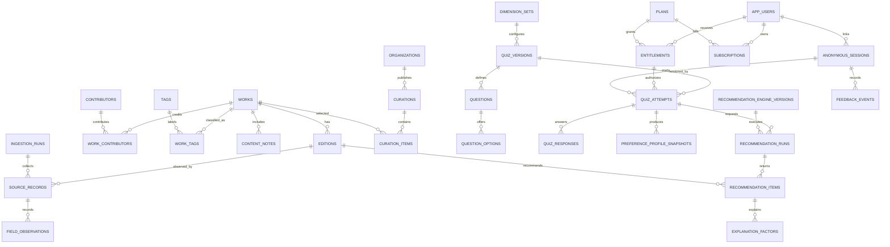

# 전체 데이터베이스 아키텍처 및 ERD

## 상태

`확정 초안 v1` - 이후 모델 문서는 이 문서의 공통 규칙을 따른다.

## 목표

- PostgreSQL을 단일 기준 저장소로 사용한다.
- 도서 카탈로그, 수집 원본, 큐레이션, 퀴즈, 익명 추천, 운영 감사를 분리한다.
- 추천 결과를 입력값, 규칙 버전, 근거와 함께 재현할 수 있어야 한다.
- 이름, 학교, 연락처 등 직접 식별정보를 저장하지 않는다.

## 스키마 경계

| 스키마 | 소유 데이터 | 대표 테이블 |
| --- | --- | --- |
| `catalog` | 작품, 판본, 사람, 특성, 태그, 내용 안내 | `works`, `editions`, `contributors` |
| `provenance` | 외부 원본, 수집 실행, 품질 이슈 | `source_records`, `ingestion_runs` |
| `curation` | 기관과 사서의 추천 목록 | `organizations`, `curations` |
| `quiz` | 질문 버전, 선택지, 점수 및 적응 규칙 | `quiz_versions`, `questions` |
| `recommendation` | 익명 세션, 프로필, 추천 실행과 피드백 | `anonymous_sessions`, `recommendation_runs` |
| `identity` | Supabase Auth 계정의 최소 앱 프로필 | `app_users` |
| `billing` | 플랜, 구독, 권한, 결제 웹훅 | `plans`, `entitlements` |
| `operations` | 평가, 관리자 감사, 중복 검토 | `recommendation_eval_runs`, `admin_audit_logs` |

애플리케이션 역할 계정에는 필요한 스키마의 CRUD 권한만 부여한다. 원본 응답과 감사 로그의 수정 및 삭제 권한은 수집 작업자와 운영자 역할로 제한한다.

## 공통 규칙

- 기본 키는 `uuid`이며 PostgreSQL의 `gen_random_uuid()`로 생성한다.
- 모든 시간은 `timestamptz`와 UTC로 저장한다.
- 변경 가능한 주요 엔터티에는 `created_at`, `updated_at`을 둔다.
- 열거형은 변경 비용이 큰 PostgreSQL `ENUM`보다 참조 테이블 또는 `text` + `CHECK` 제약을 우선한다.
- JSON 원본과 가변 규칙은 `jsonb`로 보관하되, 조회·조인·무결성이 필요한 값은 별도 열 또는 관계 테이블로 정규화한다.
- 공개 카탈로그 데이터는 물리 삭제하지 않는다. 병합된 레코드는 `merged_into_id`, 운영 중단 항목은 상태 열로 추적한다.
- 익명 세션과 응답은 보존 기간이 끝나면 작업으로 삭제하거나 비식별 집계만 남긴다.
- 추천 사용자 경로에서는 `catalog`, `quiz`, `recommendation`의 정규화 테이블만 읽는다. 외부 API를 동기 호출하지 않는다.

## 키와 삭제 정책

| 관계 | 정책 | 이유 |
| --- | --- | --- |
| `works -> editions` | `RESTRICT` | 판본이 있는 작품은 삭제하면 안 된다. |
| `works -> work_contributors`, `work_tags`, `content_notes` | `CASCADE` | 작품에 종속된 연결 데이터다. |
| `quiz_versions -> questions -> options` | `RESTRICT` | 과거 응답 재현을 보장한다. |
| `anonymous_sessions -> quiz_responses`, `recommendation_runs`, `feedback_events` | 세션 만료 작업에서 명시 삭제 | 보존 정책을 한 지점에서 강제한다. |
| `app_users -> subscriptions`, `entitlements` | 물리 삭제 금지, 비식별화 | 결제·권한 이력과 추천 재현을 보장한다. |
| `recommendation_runs -> recommendation_items -> explanation_factors` | `CASCADE` | 추천 실행에 완전히 종속된다. |
| `source_records -> field_observations` | `CASCADE` | 원본 레코드에 종속된다. |

## 최상위 ERD



## 권장 확장과 인덱스

```sql
create extension if not exists pgcrypto;
create extension if not exists pg_trgm;
```

- ISBN, 외부 소스 식별자, 활성 버전, 세션 만료 시각에는 B-tree 인덱스를 둔다.
- 제목과 정규화된 사람 이름 검색에는 `pg_trgm` GIN 인덱스를 둔다.
- `pgvector`와 임베딩 인덱스는 P2 의미 검색이 검증된 뒤에만 도입한다.
- 대량 이벤트와 수집 로그는 `created_at` 또는 `started_at` 월 단위 파티셔닝을 데이터량이 확인된 뒤 적용한다.

## 데이터 흐름

1. 수집 작업자가 외부 응답을 `provenance.source_records`에 변경 불가능한 원본으로 적재한다.
2. 검증과 병합을 거친 값만 `catalog`의 정규화 모델에 반영한다.
3. 큐레이터가 검수한 작품·판본·특성을 추천 후보로 공개한다.
4. 익명 세션 또는 연결된 계정의 권한을 서버에서 해석한 뒤, 허용된 축 집합으로 퀴즈 시도·프로필 스냅샷·추천 실행을 만든다.
5. 추천 실행은 정확한 퀴즈·엔진·데이터 기준 버전과 설명 근거를 보존한다.
6. 피드백과 오프라인 평가는 원본 추천을 수정하지 않고 별도 이벤트와 평가 실행으로 축적한다.

## 결정 사항

- 작품 단위 중복 방지는 `work_id`에서 수행하고, 사용자가 실제 획득하는 정보는 `edition_id`로 제공한다.
- 추천 실행은 수정 불가능한 기록이다. 재추천은 새 `recommendation_run`을 생성한다.
- 수집 원본은 신뢰하지 않으며, 추천 가능 여부는 데이터 품질과 운영 검수 상태를 통과한 데이터로 한정한다.
- 스키마 간 직접 쓰기는 수집·관리 작업에만 허용한다. 사용자 요청은 서비스 계층을 거친다.